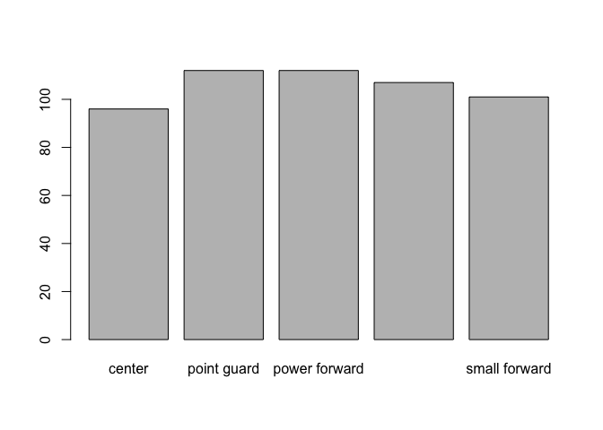
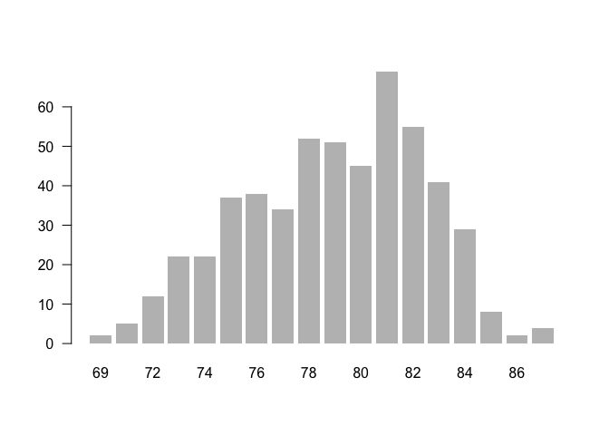
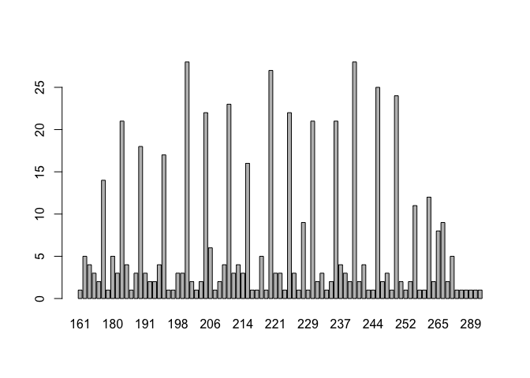
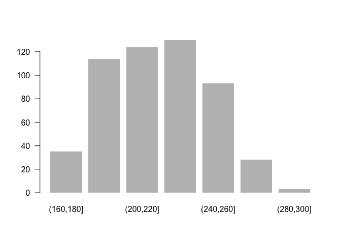
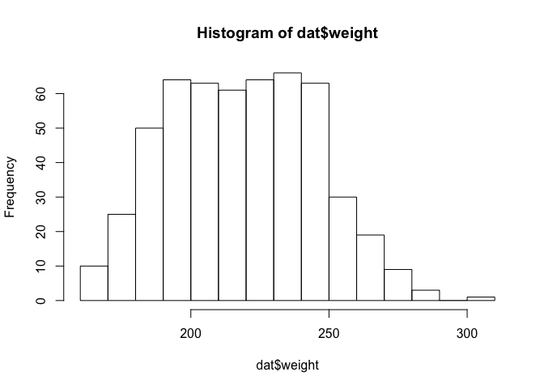
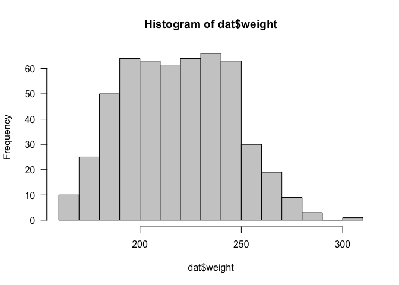
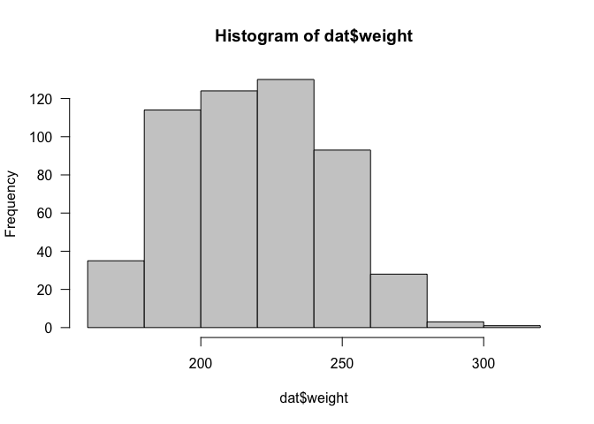
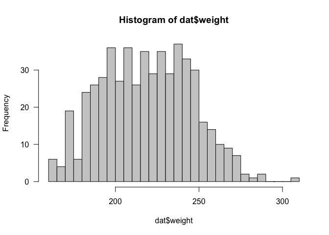

Frequencies and Histograms
================
Gaston Sanchez

## NBA Data Set

``` r
# download data set into your working directory
url <- "https://raw.githubusercontent.com/ucb-introstat/introstat-spring-2019/master/data/nba_players.csv"
dat <- read.csv(url)
```

The dataset `dat` is a `data.frame` (a tabular object) with dimensions
(i.e. number of rows and columns):

``` r
dim(dat)
```

    ## [1] 528  39

In turn, the available variables (in the columns)
    are:

``` r
colnames(dat)
```

    ##  [1] "player"                       "player_num"                  
    ##  [3] "position"                     "height"                      
    ##  [5] "weight"                       "birthdate"                   
    ##  [7] "country"                      "experience"                  
    ##  [9] "college"                      "team_stat_ranking"           
    ## [11] "age"                          "games"                       
    ## [13] "games_started"                "minutes_played"              
    ## [15] "field_goals"                  "field_goal_attempts"         
    ## [17] "field_goal_percent"           "points3"                     
    ## [19] "points3_attempts"             "points3_percent"             
    ## [21] "points2"                      "points2_attempts"            
    ## [23] "points2_percent"              "effective_field_goal_percent"
    ## [25] "free_throws"                  "free_throw_attempts"         
    ## [27] "free_throw_percent"           "offensive_rebounds"          
    ## [29] "defensive_rebounds"           "total_rebounds"              
    ## [31] "assists"                      "steals"                      
    ## [33] "blocks"                       "turnovers"                   
    ## [35] "fouls"                        "points"                      
    ## [37] "team_salary_ranking"          "salary"                      
    ## [39] "team"

To take a look at a particular variable, you can type the name of the
table, followed by the `$` sign, followed by the name of the variable:

``` r
dat$player
dat$position
```

## Frequency Tables

A common first step in examining the values of a variable is to count
the frequencies of such values. This can be easily done in R with the
function `table()`. For instance, to get the counts of the different
types of positions, run the following command:

``` r
# position frequencies
table(dat$position)
```

    ## 
    ##         center    point guard  power forward shooting guard  small forward 
    ##             96            112            112            107            101

``` r
# age frequencies
table(dat$age)
```

    ## 
    ## 19 20 21 22 23 24 25 26 27 28 29 30 31 32 33 34 35 36 37 38 39 
    ##  9 19 19 36 51 57 47 45 41 35 35 34 24 17 16  8 18  3  4  5  5

### Relative Frequencies

In order to get **relative frequencies** (i.e. proportions or fractions)
you need to divide the frequencies by the total number of observations.
You can do this in R in several ways:

``` r
# position relative frequencies (option 1)
table(dat$position) / nrow(dat)
```

    ## 
    ##         center    point guard  power forward shooting guard  small forward 
    ##      0.1818182      0.2121212      0.2121212      0.2026515      0.1912879

``` r
# position relative frequencies (option 2)
table(dat$position) / length(dat$position)
```

    ## 
    ##         center    point guard  power forward shooting guard  small forward 
    ##      0.1818182      0.2121212      0.2121212      0.2026515      0.1912879

``` r
# position relative frequencies (option 3)
prop.table(table(dat$position))
```

    ## 
    ##         center    point guard  power forward shooting guard  small forward 
    ##      0.1818182      0.2121212      0.2121212      0.2026515      0.1912879

## Bar-Charts and Pie-Charts

To visualize frequencies (or relative frequencies) you can create a
bar-chart with the function `barplot()`. All you need is to take a
`table()` and pass it inside `barplot()`:

``` r
barplot(table(dat$position))
```

<!-- -->

Another common graph to visualize frequencies is a pie-chart, which can
be produced in R with the function `pie()`. Like in a bar-chart, you can
pass a `table()` to `pie()`:

``` r
pie(table(dat$position))
```

<!-- -->

## Categorizing Quantitative Variables

Let’s consider the quantitative variable `height`, obtaining frequencies
and a bar-chart.

``` r
table(dat$height)
```

    ## 
    ## 69 71 72 73 74 75 76 77 78 79 80 81 82 83 84 85 86 87 
    ##  2  5 12 22 22 37 38 34 52 51 45 69 55 41 29  8  2  4

``` r
barplot(table(dat$height), las = 1, border = NA)
```

<!-- -->

The bar-chart reveals some information but there are some issues. Can
you guess what are those issues?

Or consider `weight`. Things can get a bit overwhelming:

``` r
table(dat$weight)
```

    ## 
    ## 161 165 170 172 173 175 179 180 183 185 186 188 189 190 191 192 193 194 
    ##   1   5   4   3   2  14   1   5   3  21   4   1   3  18   3   2   2   4 
    ## 195 196 197 198 199 200 201 202 203 205 206 207 208 209 210 212 213 214 
    ##  17   1   1   3   3  28   2   1   2  22   6   1   2   4  23   3   4   3 
    ## 215 216 217 218 219 220 221 222 223 225 226 227 228 229 230 231 232 233 
    ##  16   1   1   5   1  27   3   3   1  22   3   1   9   1  21   2   3   1 
    ## 234 235 237 238 239 240 241 242 243 244 245 246 248 249 250 251 252 253 
    ##   2  21   4   3   2  28   2   4   1   1  25   2   3   1  24   2   1   2 
    ## 255 256 257 260 263 265 270 273 275 279 280 285 289 290 307 
    ##  11   1   1  12   2   8   9   2   5   1   1   1   1   1   1

``` r
barplot(table(dat$weight))
```

<!-- -->

In these cases, it’s better to reorganize the values into groups or
categories. For example, we could form groups 160-180 pounds, 180-200,
200-220, etc:

``` r
weight2 <- cut(
  dat$weight, 
  breaks = seq(from = 160, to = 300, by = 20))

table(weight2)
```

    ## weight2
    ## (160,180] (180,200] (200,220] (220,240] (240,260] (260,280] (280,300] 
    ##        35       114       124       130        93        28         3

and then make a bar-chart of the categorized variable `weight2`

``` r
barplot(table(weight2), las = 1, border = NA)
```

<!-- -->

## Histograms

In addition to using bar-charts to visualize the frequencies of a
quantitative variable, we can also use a **histogram**.

R has the `hist()` function that allows you to create a basic histogram:

``` r
# default histogram
hist(dat$weight)
```

<!-- -->

We can specify some graphical parameters to customize the appearence of
the histogram:

``` r
hist(dat$weight, las = 1, col = 'gray80')
```

<!-- -->

More interestingly, we can also play with the argument `breaks` to
change the number of bars:

``` r
hist(dat$weight, las = 1, col = 'gray80', breaks = 8)
```

<!-- -->

Here’s another option:

``` r
hist(dat$weight, las = 1, col = 'gray80', 
     breaks = seq(from = 160, to = 310, by = 10))
```

<!-- -->

And one more histogram with more “resolution”:

``` r
hist(dat$weight, las = 1, col = 'gray80', 
     breaks = seq(from = 160, to = 310, by = 5))
```

<!-- -->
