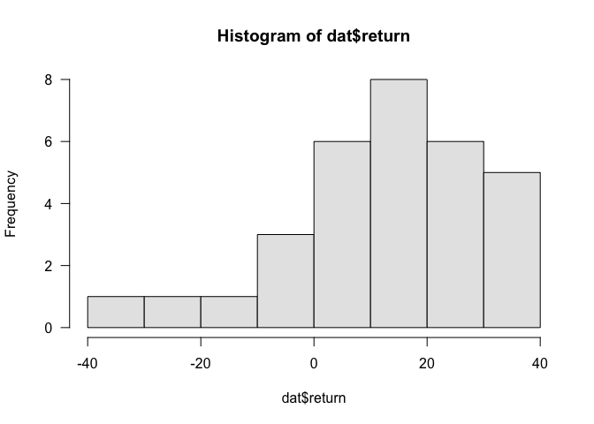
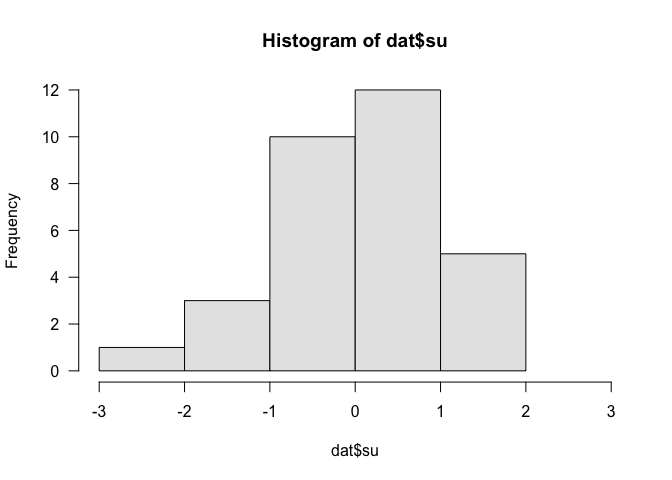
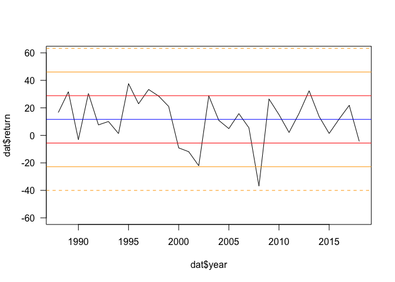

Normal Curve
================
Gaston Sanchez

## S\&P 500 Annual Returns

Fidelity
report:

<https://fundresearch.fidelity.com/mutual-funds/performance-and-risk/315911750>

  - average return (index fund): 9.88%
  - standard deviation: 11.18%

### Import Data

S\&P 500 Annual Total Return Historical Data

<https://ycharts.com/indicators/sandp_500_total_return_annual>

``` r
# download data set into your working directory
url <- "https://raw.githubusercontent.com/ucb-introstat/introstat-spring-2019/master/data/sp500_returns.csv"
dat <- read.csv(url)
```

``` r
dat
```

    ##    year return
    ## 1  2018  -4.38
    ## 2  2017  21.83
    ## 3  2016  11.96
    ## 4  2015   1.38
    ## 5  2014  13.69
    ## 6  2013  32.39
    ## 7  2012  16.00
    ## 8  2011   2.11
    ## 9  2010  15.06
    ## 10 2009  26.46
    ## 11 2008 -37.00
    ## 12 2007   5.49
    ## 13 2006  15.79
    ## 14 2005   4.91
    ## 15 2004  10.88
    ## 16 2003  28.68
    ## 17 2002 -22.10
    ## 18 2001 -11.89
    ## 19 2000  -9.10
    ## 20 1999  21.04
    ## 21 1998  28.58
    ## 22 1997  33.36
    ## 23 1996  22.96
    ## 24 1995  37.58
    ## 25 1994   1.32
    ## 26 1993  10.08
    ## 27 1992   7.62
    ## 28 1991  30.47
    ## 29 1990  -3.10
    ## 30 1989  31.69
    ## 31 1988  16.61

### Summary Statistics

``` r
summary(dat$return)
```

    ##    Min. 1st Qu.  Median    Mean 3rd Qu.    Max. 
    ## -37.000   1.745  13.690  11.620  24.710  37.580

``` r
# mean
x_mean <- (dat$return)
x_mean
```

    ##  [1]  -4.38  21.83  11.96   1.38  13.69  32.39  16.00   2.11  15.06  26.46
    ## [11] -37.00   5.49  15.79   4.91  10.88  28.68 -22.10 -11.89  -9.10  21.04
    ## [21]  28.58  33.36  22.96  37.58   1.32  10.08   7.62  30.47  -3.10  31.69
    ## [31]  16.61

``` r
# sd
x_sd <- mean(dat$return)
x_sd
```

    ## [1] 11.62484

``` r
hist(dat$return, col = 'gray90', breaks = 8, las = 1)
```

<!-- -->

### Converting to SU

``` r
dat$su <- (dat$return - x_mean) / x_sd
head(dat)
```

    ##   year return su
    ## 1 2018  -4.38  0
    ## 2 2017  21.83  0
    ## 3 2016  11.96  0
    ## 4 2015   1.38  0
    ## 5 2014  13.69  0
    ## 6 2013  32.39  0

``` r
hist(dat$su, col = 'gray90', xlim = c(-3, 3), breaks = 5, las = 1)
```

<!-- -->

### Time Line

``` r
plot(dat$year, dat$return, type = "l", las = 1, ylim = c(-60, 60))
abline(h = x_mean, col = 'blue')
abline(h = c(x_mean - x_sd, x_mean + x_sd), col = 'red')
abline(h = c(x_mean - 2*x_sd, x_mean + 2*x_sd), col = 'orange')
abline(h = c(x_mean - 3*x_sd, x_mean + 3*x_sd), col = 'orange', lty = 2)
```

<!-- -->
